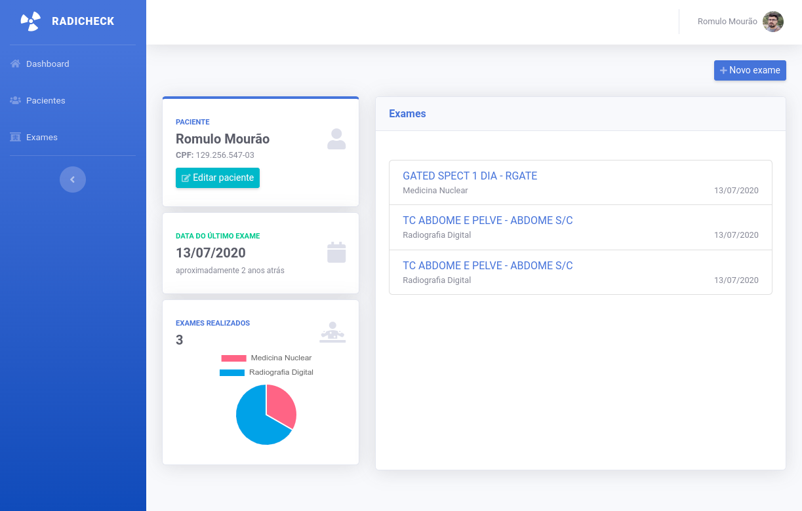

# Radicheck

> Trabalho de conclusão do curso de Sistemas de Informacão

Este trabalho propõe um sistema web, o Sistema Web para manter histórico de exposição à radiação em pacientes (RADICHECK), para atender as necessidades do departamento de radiologia do Hospital Universitário Antônio Pedro (HUAP), agilizando o processo e viabilizando o armazenamento dos exames realizados.

 
